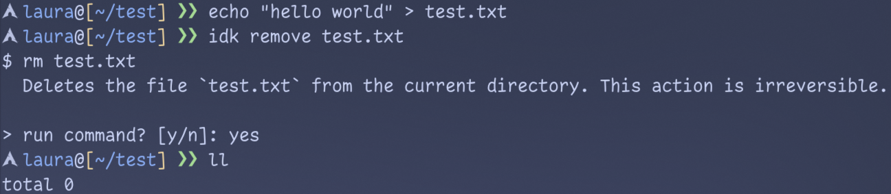

# idk



Turn plain-English questions into a single, ready-to-run shell command with a short explanation. idk streams the suggestion, detects your OS/shell and common tools, and (optionally) asks if you want to execute the command.

- Powered by OpenRouter chat completions
- Detects parent shell automatically (Windows/macOS/Linux)
- Tailors suggestions to commands available on your system
- One command per answer, plus a concise explanation

## Install

There are prebuilt, stable releases available [here](https://github.com/coalaura/idk/releases). Alternatively you can also build idk from source.

You can bootstrap **idk** with a single command. This script will detect your OS and CPU (`amd64`/`arm64`), download the correct binary and install it to `/usr/local/bin/idk`.

```bash
curl -sL https://src.w2k.sh/idk/install.sh | sh
```

## Configure

On first run, idk creates a config at `~/.idk.yml` with defaults and exits so you can add your API key.

```yaml
openrouter:
  api_key: your-api-key
  model: openai/gpt-5-chat
commands:
  ask_to_run: true
```

- `openrouter.api_key`: your OpenRouter API key
- `openrouter.model`: model slug (e.g. `openai/gpt-5-chat`)
- `commands.ask_to_run`: if true, idk prompts to execute commands

## Usage

```
# Ask a question
idk list the largest files in this directory
```

idk will stream a response like:

```
$ du -sh * | sort -h
  Summarizes sizes of entries and sorts ascending.
```

If `ask_to_run` is enabled, you'll be prompted:

```
> run command? [y/n]:
```

Press `y` to execute in your current shell (Windows uses `/C`, others use `-c`).

## Build from source

- Requirements: Go 1.24+
- Build: `go build -o idk` (Windows will produce `idk.exe`)
